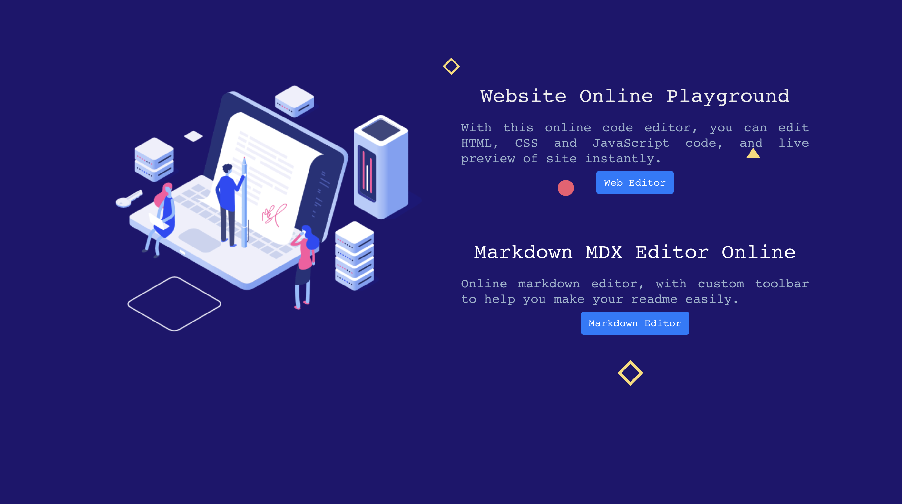
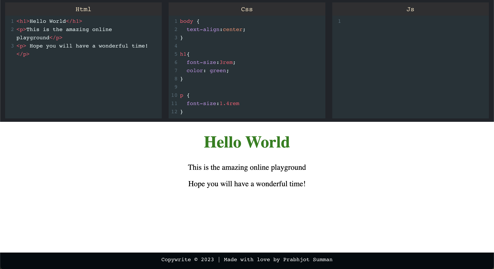
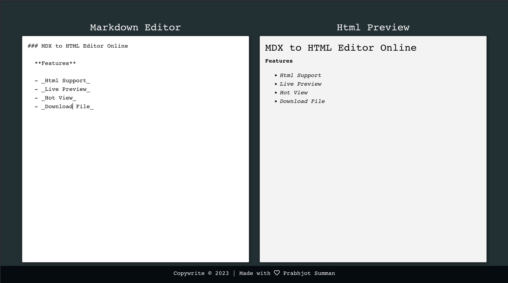

# Online HTML, CSS, JavaScript, and Markdown Editor

Welcome to the Online HTML, CSS, JavaScript, and Markdown editor! 🚀

## Online Playground to see live results in HTML,CSS, JS and Markdown

  

## Introduction

This project provides a simple yet powerful online editor for HTML, CSS, JavaScript, and Markdown. Whether you're a seasoned developer or just getting started with web technologies, this editor has got you covered. Create and preview your web content in real-time, all in one place.

## Features

- **Live Preview:** See your code come to life instantly with a live preview.
- **Multi-Language Support:** Write HTML, CSS, JavaScript, and Markdown all in one environment.
- **Responsive Design:** Test your web content on various screen sizes.
- **Syntax Highlighting:** Code with ease, thanks to syntax highlighting for each language.
- **Share Your Work:** Easily share your projects with others through unique URLs.

## Usage

1. **Choose Your Language:** Select the language you want to work with (HTML, CSS, JavaScript, or Markdown).

2. **Start Coding:** Begin writing or pasting your code in the editor.

3. **Live Preview:** Watch your code come to life in the live preview pane.

4. **Share Your Work:** If you'd like to share your project, simply copy the unique URL generated for your code.

## Online code editor for HTML, CSS and Javascript to develop live frontend code

  

## Online Markdown editor for generating Readme Files

  

## Contributing

We welcome contributions from the open-source community. If you have ideas to enhance the editor or want to fix a bug, feel free to open an issue or create a pull request. We're excited to see your creativity and skills in action!

## License

This project is licensed under the MIT License. Feel free to use and modify it as you see fit.

## Connect with Us

Have questions, feedback, or just want to say hi? Reach out!

Happy coding! 🚀